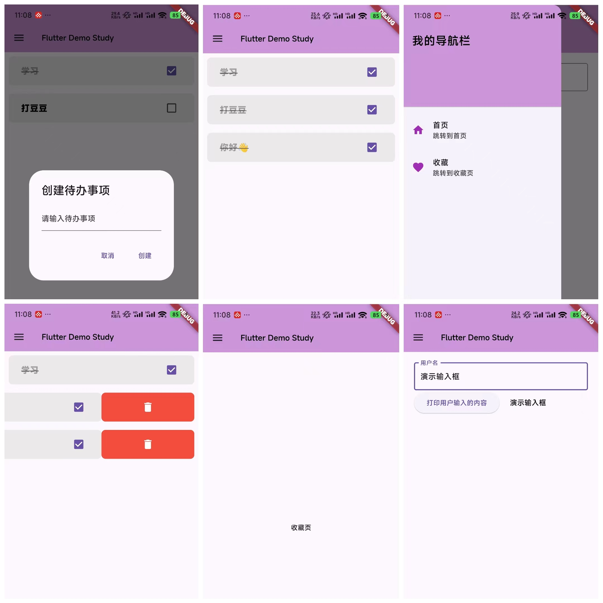

# Flutter 基础应用

这是一个简单的 Flutter 应用程序，演示了如何使用 BottomNavigationBar 和 Drawer 进行基本的页面导航 以及搭建了一个简易DemoTodoList 页面, 快速学习上手Flutter开发。

## 基本功能
- 首页
- todoList页面
- 添加项页
- 收藏页


## 组件

1. Drawer  抽屉
2. Dialog  弹框
3. TextField 文本输入框
4. Column, Padding, Container, Row 等等布局widget
5. bottomNavigationBar
6. ElevatedButton
7. floatingActionButton
8. ListView.builde 
9. ...

## 安装

安装 Flutter 以及其依赖项，可以参考[Flutter 安装指南](https://flutter.dev/docs/get-started/install)

```bash
flutter pub get
```

## 运行

```bash
flutter run
```

## 页面展示



